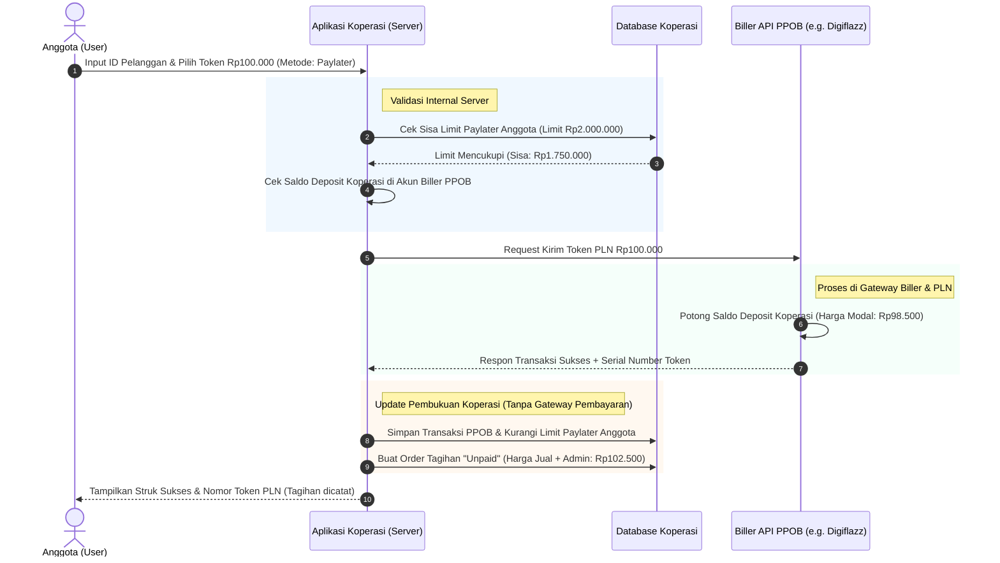

# Alur Sistematis Transaksi PPOB Paylater Koperasi (Tanpa Payment Gateway)

Dokumen ini menjelaskan rancangan arsitektur, alur data, dan mekanisme settlement finansial untuk transaksi PPOB (Pulsa, PLN, E-Wallet, dan Tagihan) menggunakan sistem **Paylater Internal Koperasi** pada Koperasi Sulfindo.

---

## 1. Konsep Dasar & Arsitektur Sistem

Secara sistem, transaksi ini berjalan **tanpa menggunakan Payment Gateway pihak ketiga** (seperti Tripay/Midtrans) di sisi anggota saat melakukan pembelian. Anggota bertransaksi menggunakan **limit kredit internal** yang diberikan oleh koperasi, dan koperasi melakukan pembelian langsung ke **Biller PPOB API** menggunakan saldo deposit koperasi yang sudah di-top-up sebelumnya.

### Perbandingan Komponen Sistem

* **Biller PPOB API (e.g., Digiflazz / Mobilepulsa)**:
  Berperan sebagai penyedia produk digital (vendor/supplier). Koperasi menaruh deposit dana di Biller ini. Setiap transaksi sukses anggota akan langsung mendebit saldo deposit koperasi tersebut dengan harga modal.
* **Internal Paylater Koperasi**:
  Berperan sebagai penyedia limit kredit bagi anggota (maksimal Rp2.000.000). Transaksi anggota dicatat sebagai utang/piutang dalam database internal koperasi.
* **Payment Gateway**:
  **TIDAK DIPERLUKAN** untuk transaksi harian karena pembayaran anggota bersifat pascabayar (bayar di akhir bulan/potong gaji), bukan bayar instan di tempat.

---

## 2. Pilihan Model Aliran Dana Koperasi ke Biller PPOB

Koperasi dapat memilih satu dari dua model berikut untuk mendanai pembelian ke pihak Biller:

### Model A: Prepaid Deposit (Sangat Direkomendasikan)
Koperasi menyetorkan modal awal (misal: Rp5.000.000 atau Rp10.000.000) ke akun Biller PPOB. Saldo ini menjadi modal kerja yang berkurang otomatis sebesar **harga pokok (modal)** setiap kali anggota melakukan transaksi PPOB yang sukses.
* **Kelebihan**: Transaksi instan, didukung oleh semua Biller Indonesia, dan risiko keuangan terkontrol secara internal.
* **Kekurangan**: Koperasi harus menyediakan modal mengendap di akun Biller.

### Model B: Postpaid Credit Line (B2B postpaid)
Pihak Biller memberikan limit kredit korporat kepada koperasi berdasarkan perjanjian bisnis B2B dan jaminan hukum. Koperasi bertransaksi secara kredit, lalu Biller mengirimkan invoice tagihan secara berkala (misal: mingguan atau bulanan).
* **Kelebihan**: Koperasi tidak perlu menaruh modal mati/deposit di awal.
* **Kekurangan**: Proses verifikasi kredit korporat yang sangat ketat, serta biasanya hanya diberikan untuk koperasi skala besar dengan ribuan transaksi harian.

---

## 3. Diagram Alur Transaksi Harian (Prepaid Deposit Model)

Bagan berikut menunjukkan alur data saat Anggota melakukan pembelian produk PPOB (misal: token PLN Rp100.000) secara Paylater:



---

## 4. Langkah-Langkah Detak Aliran Sistem (Step-by-Step)

### Langkah 1: Permintaan Transaksi
Anggota membuka menu **Transaksi PPOB** di aplikasi mobile/web koperasi, memasukkan nomor tujuan/ID pelanggan, memilih nominal produk (misal: Pulsa Rp100.000 dengan harga jual koperasi Rp101.500), memasukkan PIN Transaksi 6 digit, lalu menekan konfirmasi.

### Langkah 2: Pengecekan Limit & Saldo Internal
Server aplikasi melakukan verifikasi ganda secara internal:
1. Memeriksa apakah sisa limit Paylater anggota mencukupi untuk harga jual produk ($Rp101.500 \le \text{Sisa Limit}$).
2. Memeriksa apakah saldo deposit koperasi di akun Biller PPOB mencukupi untuk memotong harga beli modal ($Rp99.000 \le \text{Saldo Deposit Biller}$).

### Langkah 3: Eksekusi API Biller
Server mengirimkan payload API ke Biller (e.g. Digiflazz) secara aman via HTTPS POST menggunakan kredensial API Biller yang dikonfigurasikan di halaman Pengaturan PPOB Admin.

### Langkah 4: Respons & Pengiriman Produk
Biller menerima request, memotong saldo deposit koperasi, memproses pengiriman produk ke operator provider/PLN, dan mengirimkan respons balik berupa payload JSON berisi status transaksi (Success/Failed) beserta Serial Number (SN) atau Nomor Token PLN.

### Langkah 5: Pencatatan Ledger & Reduksi Limit
Apabila transaksi dikonfirmasi SUKSES oleh Biller:
1. Transaksi disimpan di tabel `ppob_transactions` dengan metode pembayaran `paylater` dan status `success`.
2. Sistem otomatis membuat entri baru pada tabel `orders` dengan status pembayaran `unpaid` senilai harga jual koperasi.
3. Sisa limit kredit Paylater anggota dikurangi secara real-time sebesar nilai transaksi.

---

## 5. Alur Settlement Akhir Bulan (Billing & Penagihan)

Settlement finansial berjalan secara berkala tanpa pemotongan saldo tunai anggota di tengah jalan:

```
[Transaksi Harian Anggota] 
        │ (Status: Unpaid Order / Limit Kredit Terpotong)
        ▼
[Tanggal Cut-Off Bulanan (e.g., Tanggal 25)]
        │ (Sistem melakukan rekapitulasi utang paylater)
        ▼
[Penyelesaian Pembayaran]
        ├─► Opsi 1: Potong Gaji Langsung (Divisi Payroll Perusahaan)
        └─► Opsi 2: Anggota Transfer Kolektif ke Rekening Koperasi
        │
        ▼
[Reset Limit Paylater]
        └─► Admin Koperasi mengubah status order menjadi "PAID"
        └─► Limit kredit anggota otomatis kembali utuh (Rp2.000.000)
```

### Keuntungan Finansial bagi Koperasi & Anggota
* **Tanpa Potongan Biaya Gateway (MDR)**: Transaksi kecil PPOB (seperti pulsa Rp5.000) tidak terkena potongan biaya admin merchant dari Payment Gateway (seperti Rp2.000-Rp5.000 per transaksi QRIS/VA) yang dapat merugikan margin koperasi.
* **Bunga & Margin Terkelola**: Koperasi bebas menentukan margin keuntungan per transaksi PPOB yang akan masuk langsung ke SHU (Sisa Hasil Usaha) koperasi.
