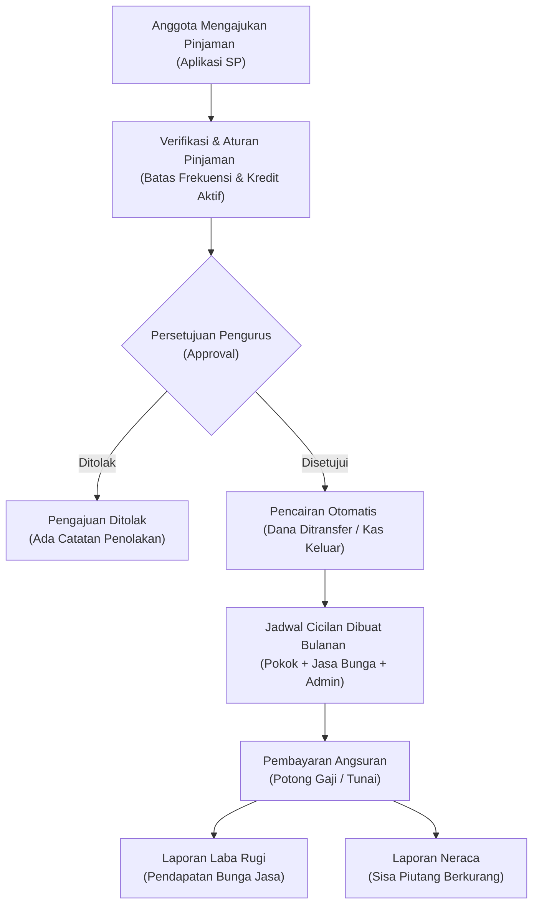

# PANDUAN AWAM: ALUR AKUNTANSI KOPERASI SULFINDO

Buku panduan ini disusun dengan bahasa sederhana yang mudah dipahami oleh orang awam (non-akuntan) untuk menjelaskan bagaimana roda keuangan, transaksi harian, dan sistem pembukuan di Koperasi Karyawan Sulfindo berputar dari awal hingga tersaji menjadi Laporan Keuangan resmi.

---

## 1. Skema Keluar Masuk Uang Secara Global (Aliran Kas Koperasi)

Secara sederhana, koperasi dapat diibaratkan sebagai sebuah **"Dompet Besar Bersama"**. Tugas utama pengurus koperasi adalah mengelola agar uang yang masuk ke dompet ini dapat berputar secara aman dan menghasilkan manfaat (keuntungan/SHU) yang nantinya akan dikembalikan lagi kepada seluruh anggota.

### A. Uang Masuk ke Koperasi (Kas Masuk / Debit)
Uang tunai atau saldo bank koperasi bertambah dari sumber-sumber berikut:
1. **Setoran Permodalan Anggota**:
   * **Simpanan Pokok**: Uang modal awal yang disetor sekali saja saat pertama kali mendaftar menjadi anggota.
   * **Simpanan Wajib**: Iuran wajib yang disetor setiap bulan secara rutin.
2. **Aktivitas Pinjaman**:
   * **Pengembalian Cicilan Pinjaman**: Anggota membayar cicilan bulanan yang terdiri dari pengembalian modal awal (**Pokok**) dan tambahan keuntungan koperasi (**Bunga Jasa**).
   * **Denda Keterlambatan**: Jika anggota terlambat membayar cicilan dari tanggal jatuh tempo.
   * **Biaya Administrasi & Transfer**: Biaya admin di awal saat pinjaman disetujui dan dicairkan.
3. **Aktivitas Toko & Minimarket (Retail)**:
   * **Penjualan Sembako & Barang Toko**: Uang hasil penjualan barang sehari-hari kepada anggota maupun umum secara tunai, QRIS, atau cicilan potong gaji (kredit toko/paylater).
4. **Pendapatan Layanan Lain**:
   * Hasil dari penjualan pulsa, token listrik, pembayaran tagihan (PPOB), atau komisi konsinyasi (titip jual) barang pihak ketiga.

### B. Uang Keluar dari Koperasi (Kas Keluar / Kredit)
Uang tunai atau saldo bank koperasi berkurang untuk keperluan berikut:
1. **Penyaluran Pinjaman**:
   * Koperasi meminjamkan uang tunai kepada anggota yang membutuhkan (setelah pengajuan disetujui).
2. **Belanja Stok Minimarket (Procurement)**:
   * Koperasi membayar ke supplier/distributor untuk membeli barang dagangan (sembako, sabun, beras, dll.) agar rak minimarket tetap penuh.
3. **Biaya Operasional Koperasi**:
   * Pembayaran gaji karyawan toko/koperasi, honorarium pengurus, biaya listrik, air, internet, cetak formulir, ATK, pajak, dan penyusutan aset (seperti lemari pendingin kasir atau komputer).
4. **Penarikan Simpanan Sukarela**:
   * Anggota mengambil kembali tabungan sukarelanya untuk keperluan mendesak.
5. **Pembagian Sisa Hasil Usaha (SHU)**:
   * Pembagian keuntungan bersih tahunan kepada seluruh anggota secara adil dalam forum Rapat Anggota Tahunan (RAT).

### C. Konsep Keseimbangan (Double-Entry Accounting)
Setiap kali uang masuk atau keluar, sistem komputer koperasi mencatatnya di dua tempat secara berpasangan agar seimbang:
* Jika **Uang Kas bertambah** (Debit), sistem harus mencatat **dari mana sumbernya** (Kredit - apakah dari simpanan wajib, angsuran pinjaman, atau penjualan sembako).
* Jika **Uang Kas berkurang** (Kredit), sistem harus mencatat **untuk apa digunakan** (Debit - apakah untuk membayar supplier sembako, menyalurkan pinjaman, atau membayar gaji karyawan).

---

## 2. Skema Pinjaman & Alur Transaksinya Sampai Menjadi Laporan

Bagian ini menjelaskan bagaimana proses seorang anggota meminjam uang hingga transaksi tersebut terolah otomatis menjadi laporan piutang dan pendapatan jasa koperasi.



### A. Alur Langkah-demi-Langkah (Siklus Pinjaman)
1. **Pengajuan**: Anggota mengajukan jenis pinjaman (Pinjaman Uang, Barang, atau Kilat) beserta nominal, tenor (jangka waktu bulan), dan tujuan penggunaan melalui sistem.
2. **Penyaringan Sistem (Loan Rules)**: Sistem memeriksa otomatis apakah pengaju masih memiliki pinjaman aktif yang belum lunas atau melebihi batas pengajuan bulanan.
3. **Persetujuan & Biaya**: Pengurus meninjau pengajuan. Jika disetujui, sistem secara otomatis:
   * Menghitung **Biaya Administrasi** (berdasarkan persentase produk pinjaman).
   * Menghitung bunga flat per bulan.
4. **Pencairan & Pembentukan Jadwal (Disbursement)**:
   * **Pertanyaan Anggota**: *Apakah dana pinjaman baru dihitung masuk transaksi setelah petugas mengeluarkan dana manual lewat menu `/akuntansi/transaksi`?*
   * **Jawabannya: TIDAK**. Proses pencatatan dana keluar ini terjadi secara **otomatis** dan langsung saat pengurus menekan tombol **"Approve" (Setujui)** pada sistem pinjaman. Sistem langsung membuat catatan akuntansi:
     * **Piutang Pinjaman Anggota** bertambah (Debit).
     * **Bank/Kas Koperasi** berkurang (Kredit) sebesar nominal bersih yang diterima anggota.
     * **Pendapatan Administrasi/Transfer** langsung terbentuk.
     * Sistem juga secara otomatis membuat **Jadwal Angsuran bulanan** terperinci (dari Angsuran 1 hingga akhir) berisi pemisahan nominal Pokok, Bunga Jasa, dan biaya transfer.
5. **Penagihan & Pembayaran**:
   * Setiap bulan, anggota membayar angsuran. Sebagian besar dilakukan melalui mekanisme **Potong Gaji (Salary Cut)** otomatis, sisanya secara Tunai.
   * Saat cicilan dibayar lunas oleh anggota:
     * **Kas/Bank Koperasi bertambah** (Debit).
     * **Piutang Pinjaman Anggota berkurang** (Kredit - karena hutang anggota sudah dicicil).
     * **Pendapatan Jasa Bunga bertambah** (Kredit - sebagai keuntungan riil koperasi).

### B. Bagaimana Transaksi Ini Berubah Menjadi Laporan?
* **Laporan Laba Rugi (Pendapatan)**: Bunga jasa yang berhasil ditagih dari cicilan bulanan (`interest_paid`) langsung ditarik otomatis oleh sistem sebagai **Pendapatan Bunga Pinjaman**. Biaya admin awal dicatat sebagai **Pendapatan Administrasi**. Kedua nilai ini memperbesar keuntungan (SHU) koperasi.
* **Laporan Neraca (Aset/Harta)**: Total sisa saldo pinjaman dari seluruh anggota yang belum lunas disajikan di sisi Aset Lancar sebagai **Piutang Pinjaman Anggota**. Begitu ada pembayaran cicilan, nilai piutang di Neraca akan otomatis berkurang secara real-time.
* **Laporan Arus Kas**: Pencairan dana dicatat sebagai pengeluaran operasional simpan-pinjam, sedangkan penerimaan cicilan pokok dicatat sebagai pemasukan operasional simpan-pinjam.

---

## 3. Skema Penjualan & Pembelian Barang Toko Sampai Menjadi Laporan

Koperasi memiliki unit bisnis toko/minimarket yang melayani kebutuhan sembako dan barang konsumsi anggota.

### A. Alur Pembelian Stok Barang (Koperasi Membeli Ke Supplier)
1. **Pemesanan (Purchase Order - PO)**: Pengurus membuat pesanan resmi ke Supplier mengenai jenis sembako dan jumlahnya.
2. **Penerimaan Barang (Goods Receipt - GR)**: Ketika truk supplier datang, petugas memeriksa kesesuaian jumlah fisik dan harga beli. Begitu dicocokkan dan disetujui (Approved):
   * **Stok Barang di Minimarket otomatis bertambah**.
   * Sistem mencatat harga beli barang tersebut sebagai modal dasar.
   * Terbentuk **Hutang Usaha ke Supplier** jika belum dibayar tunai.
3. **Pembayaran PO**: Koperasi membayar tagihan supplier lewat Bank. Kas Bank Koperasi berkurang (Kredit) dan Hutang Usaha berkurang (Debit).

### B. Alur Penjualan Barang (Pelanggan/Anggota Belanja di Toko)
1. **Transaksi Kasir (Point of Sale - POS)**: Anggota mengambil sembako di rak dan membawanya ke kasir. Kasir memindai barcode barang.
2. **Metode Pembayaran**: Pembeli membayar belanjaannya dengan tiga cara:
   * **Tunai**: Membayar uang fisik ke laci kasir.
   * **QRIS/Non-Tunai**: Memindai kode QRIS bank.
   * **Paylater (Kredit Toko/Potong Gaji)**: Anggota tidak membayar di kasir, melainkan tagihan belanjanya dimasukkan ke rekap potongan gaji bulanan mereka.
3. **Pengurangan Stok**: Begitu struk dicetak oleh mesin kasir, **stok barang di rak secara otomatis berkurang** di database.

### C. Bagaimana Transaksi Toko Berubah Menjadi Laporan Keuangan?
Sistem akuntansi koperasi menarik data penjualan secara otomatis tanpa perlu diinput manual satu per satu:
1. **Laporan Laba Rugi (Pendapatan Toko & HPP)**:
   * **Omzet Penjualan**: Semua belanjaan lunas dikumpulkan sebagai **Pendapatan Penjualan Minimarket**.
   * **Harga Pokok Penjualan (HPP) / Modal Barang**: Sistem menghitung otomatis modal barang yang terjual. Contoh: Jika terjual 10 botol minyak goreng dengan harga jual Rp 20.000/botol (Omzet Rp 200.000) dan harga beli dari supplier adalah Rp 17.000/botol (HPP Rp 170.000), maka sistem mencatat HPP sebesar Rp 170.000.
   * **Laba Kotor**: Omzet Penjualan dikurangi HPP (Rp 200.000 - Rp 170.000 = Untung Kotor Rp 30.000). Untung kotor toko inilah yang masuk ke pendapatan Laba Rugi.
2. **Laporan Neraca (Persediaan & Hutang)**:
   * **Persediaan Barang Dagang**: Semua barang yang masih terpajang di rak toko dan belum laku terjual dihitung otomatis (Jumlah stok sisa dikali harga beli supplier) dan disajikan sebagai Aset Lancar berupa **Persediaan Barang**.
   * **Hutang dagang**: Jika ada pembelian barang ke supplier yang belum dilunasi, dicatat sebagai **Hutang Usaha** di kelompok Kewajiban.

---

## 4. Alur Transaksi Mikro (Proses Detail di Belakang Layar)

Berikut adalah rincian proses mikro (sangat detail) dari transaksi harian terkecil yang terjadi di dalam sistem koperasi karyawan:

### A. Penerimaan Anggota Baru (Penyertaan Modal Awal)
Setiap karyawan yang mendaftar menjadi anggota koperasi harus menyetor modal awal sebagai bentuk kepemilikan.
1. **Proses Mikro**: Karyawan mengisi formulir -> Pengurus mengaktifkan NIK di sistem -> Anggota menyetor uang tunai/transfer sebesar:
   * **Simpanan Pokok** (misal: Rp 100.000 - bayar sekali seumur hidup).
   * **Simpanan Wajib Pertama** (misal: Rp 50.000 - bayar tiap bulan).
2. **Pencatatan Jurnal Akuntansi**:
   ```text
   [DEBIT]  Kas Utama / Rekening Bank Koperasi    : Rp 150.000  (Uang fisik masuk)
     [KREDIT] Ekuitas - Simpanan Pokok Anggota    : Rp 100.000  (Modal kepemilikan)
     [KREDIT] Ekuitas - Simpanan Wajib Anggota    : Rp  50.000  (Modal kepemilikan)
   ```
3. **Efek ke Laporan**: Modal ekuitas koperasi langsung bertambah Rp 150.000 di Laporan Neraca, siap digunakan untuk memutar usaha minimarket atau dipinjamkan ke anggota lain.

### B. Tabungan Sukarela Bulanan & Penarikannya (Dana Titipan)
Simpanan Sukarela sifatnya sangat fleksibel mirip tabungan biasa di bank umum.
1. **Penyetoran Mikro**: Anggota menitipkan uang tabungan sukarela ke kasir koperasi.
   * **Catatan Jurnal**:
     ```text
     [DEBIT]  Kas Utama Koperasi                  : Rp 200.000  (Uang fisik masuk)
       [KREDIT] Kewajiban - Simpanan Sukarela     : Rp 200.000  (Koperasi berhutang/wajib mengembalikan)
     ```
2. **Penarikan Mikro**: Anggota datang ke kantor koperasi untuk mengambil tabungan sukarelanya.
   * **Catatan Jurnal**:
     ```text
     [DEBIT]  Kewajiban - Simpanan Sukarela       : Rp 150.000  (Titipan anggota berkurang)
       [KREDIT] Kas Utama Koperasi                : Rp 150.000  (Uang fisik keluar diberikan ke anggota)
     ```
3. **Efek Laporan**: Simpanan Sukarela **bukan merupakan modal koperasi** melainkan masuk kelompok **Kewajiban (Hutang Lancar)** pada Laporan Neraca, karena sewaktu-waktu anggota berhak menariknya kembali.

### C. Mekanisme Potong Gaji (Salary Deduction) Terintegrasi
Setiap akhir bulan, terjadi siklus mikro pemotongan gaji karyawan perusahaan untuk menyelesaikan kewajiban mereka di koperasi secara otomatis.
1. **Langkah 1 (Rekapitulasi)**: Sistem koperasi secara otomatis merekap semua kewajiban bulanan setiap anggota:
   * Simpanan Wajib Bulanan
   * Angsuran Pokok Pinjaman + Bunga Jasa Pinjaman (`ADM`)
   * Biaya Transfer Pinjaman baru (`B-TRSF`)
   * Pembelian Sembako Toko (kredit barang/paylater)
2. **Langkah 2 (Pengiriman Data)**: Sistem mengekspor data rekapitulasi ke format Excel (melalui menu Laporan Analitik Potongan Gaji) untuk diserahkan kepada HRD/Payroll Perusahaan Sulfindo.
3. **Langkah 3 (Eksekusi Payroll)**: HRD memotong gaji karyawan secara kolektif sesuai data rekap tersebut saat gajian.
4. **Langkah 4 (Pelunasan Massal di Koperasi)**: Perusahaan mentransfer dana potongan gaji secara gelondongan (satu jumlah besar) ke Rekening Bank Koperasi. Pengurus mencatat pelunasan massal di sistem:
   * **Catatan Jurnal**:
     ```text
     [DEBIT]  Rekening Bank Koperasi              : Rp [Total Transfer Kolektif]
       [KREDIT] Piutang Pinjaman Anggota          : Rp [Sesuai Porsi Cicilan Pokok]
       [KREDIT] Pendapatan Jasa Bunga             : Rp [Sesuai Porsi Bunga ADM]
       [KREDIT] Piutang Toko/Sembako              : Rp [Sesuai Porsi Kredit Belanja]
       [KREDIT] Ekuitas - Simpanan Wajib          : Rp [Sesuai Porsi Simpanan Wajib]
     ```

### D. Pembagian SHU Akhir Tahun (Sisa Hasil Usaha)
SHU adalah laba bersih koperasi setelah dikurangi beban operasional selama satu tahun buku.
1. **Proses RAT (Rapat Anggota Tahunan)**: Anggota menyepakati persentase alokasi pembagian SHU sesuai AD/ART. Contoh alokasi:
   * 40% Cadangan Koperasi (untuk memperkuat modal dalam bentuk kas ditahan).
   * 30% Jasa Anggota (Jasa Modal) - dibagikan proporsional berdasarkan jumlah Simpanan Pokok & Wajib masing-masing.
   * 20% Jasa Transaksi (Jasa Usaha) - dibagikan berdasarkan keaktifan anggota berbelanja di minimarket atau meminjam uang.
   * 10% Dana Pengurus, Pengawas, dan Karyawan.
2. **Proses Mikro di Sistem**: Sistem menghitung porsi SHU per anggota berdasarkan rekap data simpanan dan total belanja/pinjaman mereka sepanjang tahun.
3. **Eksekusi Pembayaran SHU**: SHU ditransfer langsung ke rekening bank anggota atau dikreditkan (ditambahkan) otomatis ke saldo **Simpanan Sukarela** masing-masing anggota di dalam sistem.
   * **Catatan Jurnal**:
     ```text
     [DEBIT]  Laba Ditahan / SHU Berjalan         : Rp [Total SHU dibagikan]
       [KREDIT] Kewajiban - Simpanan Sukarela     : Rp [Porsi SHU dimasukkan ke tabungan]
       [KREDIT] Kas/Bank Koperasi                 : Rp [Porsi SHU yang dicairkan tunai/transfer]
     ```

---

## Ringkasan Alur Data Transaksi Ke Laporan

```text
  TRANSAKSI MIKRO                    SISTEM DATABASE                       LAPORAN KEUANGAN
 ─────────────────                  ─────────────────                     ──────────────────
 Anggota Belanja POS   ───►  Tabel 'orders' & 'order_items'  ───►  Pendapatan Toko & HPP (Laba Rugi)
                                                                   Stok Barang Tersisa (Neraca)

 Pencairan Pinjaman    ───►  Tabel 'loans' & 'schedules'     ───►  Piutang Anggota (Neraca)
                                                                   Pendapatan Jasa & Admin (Laba Rugi)

 Setoran Anggota       ───►  Tabel 'savings' & 'journal'     ───►  Simpanan Pokok & Wajib (Neraca-Ekuitas)
                                                                   Simpanan Sukarela (Neraca-Kewajiban)
```

Dengan sistem akuntansi digital yang terintegrasi ini, setiap transaksi mikro terkecil sekalipun yang dilakukan oleh kasir toko, petugas simpan pinjam, maupun pengurus secara otomatis terhubung langsung ke pembukuan jurnal umum (double-entry). Hal ini menjamin transparansi, akurasi, dan kemudahan dalam penyajian laporan keuangan yang siap diaudit kapan saja.
